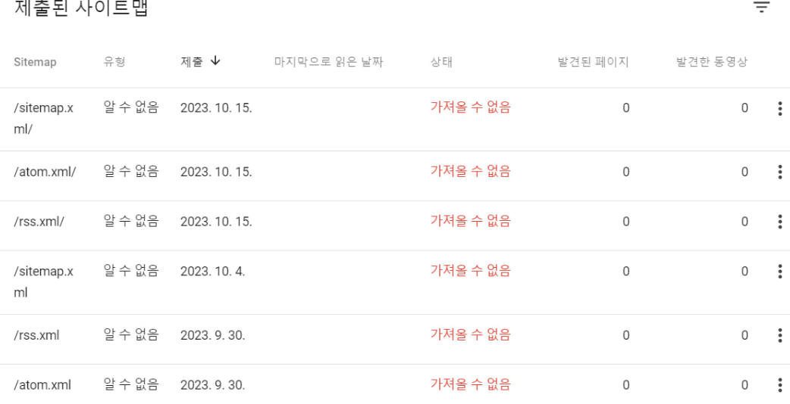
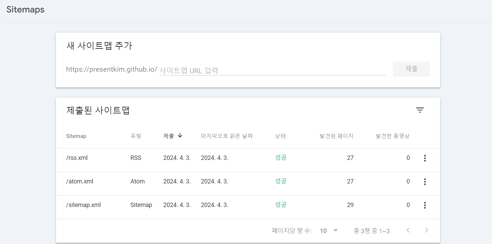

오늘은 오랜기간 저를 고통스럽게 했던 Google Search Console의 `사이트맵을 가져올 수 없음` 문제를 해결한 과정을 기록해보려고 합니다.

 _모든 방법에 실패해버린 슬픈 사진_

# 문제 상황

블로그를 만드는 모든 사람이 그러하듯 저도 인터넷에 검색할 때 짠!하고 제 블로그가 나오길 바라고 있었습니다.
그래서 블로그가 준비되자마자 블로그 주소를 구글, 빙은 물론 네이버와 다음의 검색엔진에 전부 등록했죠.
하지만 구글의 Google Search Console에서 `사이트맵을 가져올 수 없음`이라며 블로그가 등록되지 않았습니다.

대부분의 블로그 유입은 구글 검색으로 들어올 것이라고 생각했기 때문에 더 스트레스 받았었죠.
몇 개월의 시간 동안 저와 비슷한 문제를 겪는 사람들의 글을 보며 수많은 해결 방법을 시도해봤지만 결국 실패하고,
글도 쓰지 못한 채 이 문제를 해결하기 위해 시간을 쏟아가 점점 블로그 운영에 대한 의욕을 잃어 한동안 블로그를 방치하게 되었습니다.

:::info 제가 시도해본 방법들

> 혹시나 누군가에겐 해결책이 될 수 있으니 제가 시도해본 방법들은 남겨놓을게요.

- `sitemap.xml/?test` 처럼 `?`나 `/`를 붙여보세요
- `sitemap.xml` 파일을 `sitemap`로 변경해보세요.
- `sitemap.xml` 대신 `rss.xml`이나 `atom.xml` 파일을 만들어보세요.
- `robots.txt` 파일에 `Sitemap: https://{당신의 도메인}/sitemap.xml` 를 추가해보세요.
- 사이트 속성 말고 도메인 속성으로 등록해서 시도해보세요
- 이미 도메인 속성이라면 `https://{당신의 도메인}/sitemap.xml` 처럼 전체 경로를 입력해보세요.
- `{당신의 깃헙 아이디}.github.io`가 아닌 이름으로 레포를 만들고 도메인을 설정해보세요.
- GihubPages가 아니라 Vercel 등 다른 플랫폼으로 이전해서 시도해보세요.

:::

---

### 해결 방법

사실 제 문제가 해결된 방법은 너무 간단해서 오히려 이 방법을 시도하지 않은 제가 바보 같았습니다.
어제 "블로그를 다시 하긴 해야하는데..." 하는 생각에 해결 방법을 고민하던 중,
"이거 결국 *.github.io에서 리디렉션 되는거잖아?"라는 생각이 들었습니다.

그래서 그냥 해보긴 해야지 하는 심정으로 별 기대없이 Google Search Console에 들어가 
`https://presentkim.github.io` 사이트를 추가하고 사이트맵을 등록했더니 바로 등록이 되었습니다.

 _허무할 정도로 간단하게 사이트맵 등록 성공_

# 결론

사이트맵은 등록되었지만, 실제로 페이지가 색인되진 않아서 조금 더 기다려봐야겠지만,
이제 블로그가 검색엔진에 등록되어 누군가에게 도움이 되길 바라는 마음으로 글을 마칩니다.

추후에 색인까지 완료되면 이 글을 수정해서 결과를 자랑해보도록 하겠습니다. ㅎㅎ