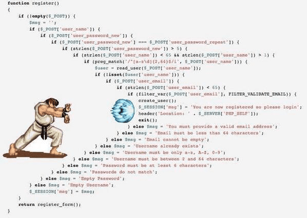
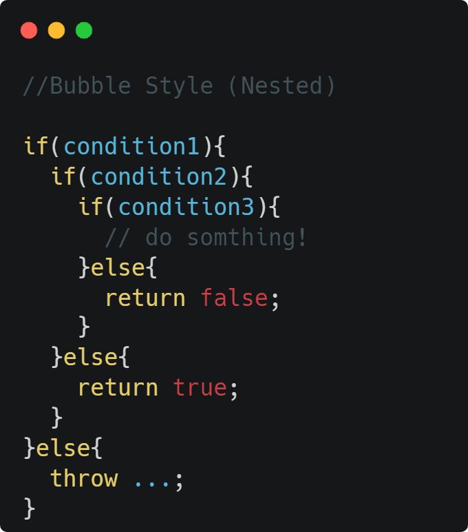
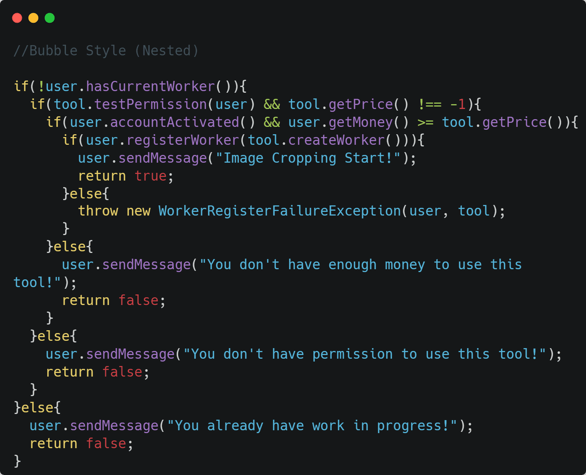
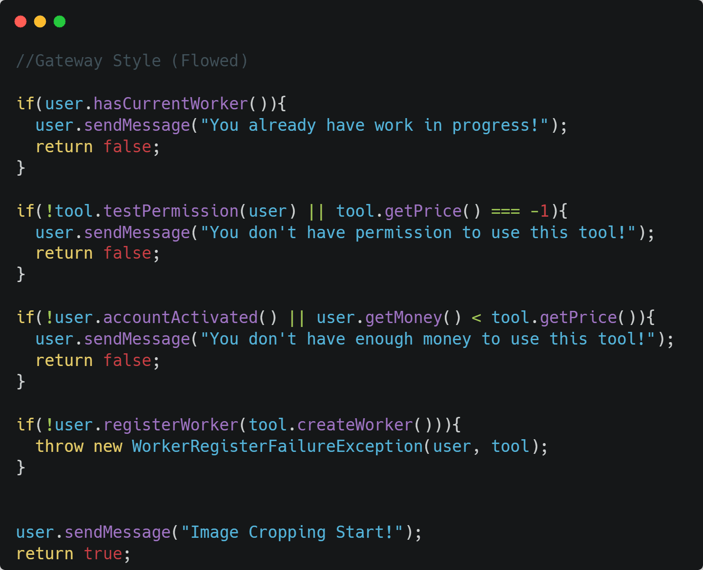

## _****_

 

## 🚩 개요

개발을 하다보면 코드가 뭔가 복잡하고 읽고 이해하기 힘들때가 있습니다.
코드의 가독성이 떨어지는 이유 중 가장 흔한 `중첩된 조건문`을 개선하는 방법에 대해 생각해봅시다.

---

## ❕조건문을 작성하는 방식 두가지

중첩된 분기의 조건문을 작성하는 방식은 아래의 두가지로 크게 나뉩니다.

1번의 Bubble Style의 경우 이 포스트의 주제인 중첩 조건문(nested if statement) 방식입니다.
조건식이 위쪽에 모여있어 상단의 분기로 가는 첫번째 흐름은 보기 쉽지만, 아래쪽 라인처럼 `else`가 모여있는 곳의 코드를 파악하기가 굉장히
어렵습니다.

2번의 Gateway Style의 경우 `빠른 반환(early return)`이라고도 불리는 방식입니다.
기존의 코드의 조건식을 반대로 뒤집어 스코프를 벗어나는 되는 부분을 먼저 처리하는 구조이기 때문에,
1번에 비해 훨씬 읽기가 편하고 코드의 흐름이 어디서 중단되는지 파악하기 쉬운 구조를 갖고 있습니다.

위 예제에선 단순하게 `condition1`같은 형식으로 적어서 읽기가 편하지만, 만약 조건문이 아래와 같다면 굉장히 난해한 코드가 됩니다.

사소하지만 2번 방식의 또하나의 장점인 들여쓰기가 줄어든다는 점 덕분에,
줄 길이의 부족으로 두줄이 되는 코드도 한줄에 들어가게 되죠.

---

## 🖐️마침

코드를 먼저 목적에 따라 작성한 뒤 위처럼 개선하는 과정이 있다면, 추후 다시 코드를 읽고 파악할 때 큰 도움이 될 것 같습니다.
가독성이 좋은 코드를 쓰는 습관을 들이기 위해 가장 기초적인 더러운 코드(code smells) 사례를 포스트로 작성해봤는데,
생각보다도 분량이 더 짧은 느낌이네요... 가독성을 위한 포스트를 더 작성하다가 유사한 내용이 나오면 합쳐야겠습니다...ㅎㅎ

 
