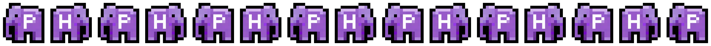
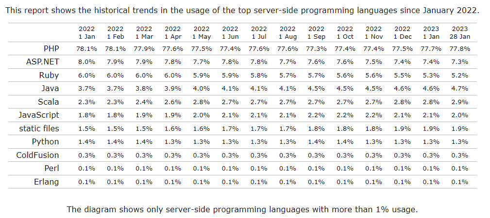
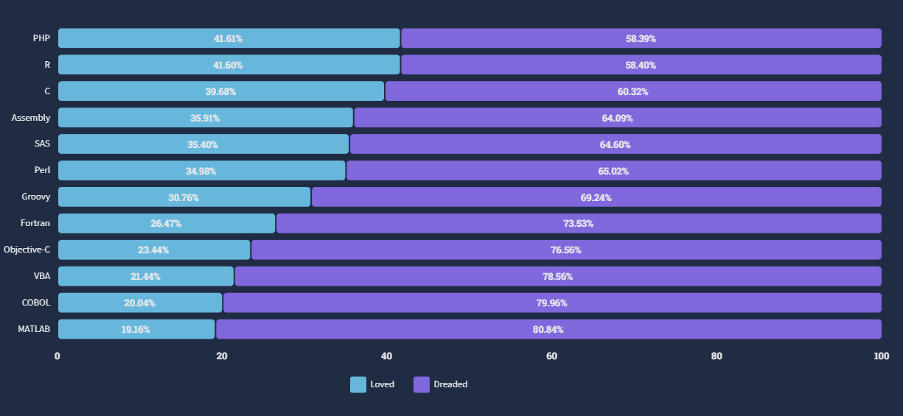
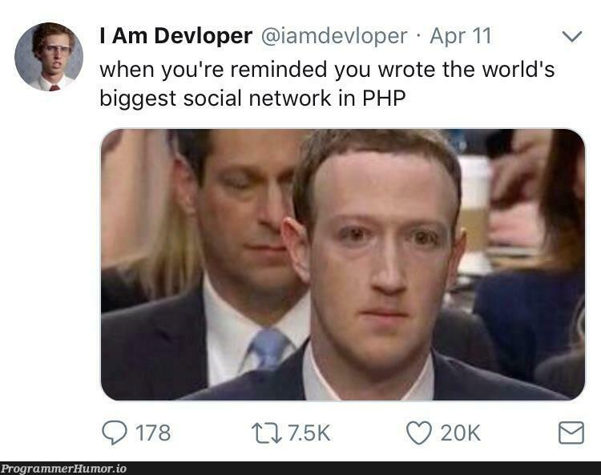

<br/>

# 🚩 개요

제가 [🐘 PHP : 간단하게 알아보는 PHP의 역사](/posts/php/php-history)를 작성한 지 반년이 지났습니다.
사실 PHP에 관련된 글을 작성하려는 시도를 여러번 했었는데,
더 자세히...더 정확히...하고 욕심내다가 결국 대부분의 글이 마무리되지 못한 채 방치되었습니다.

이제는 블로그를 더 이상 방치하지 않고 글을 많이 남기자는 목적을 갖고 글을 적어보기로 했습니다.
너무 정확하거나 많은 정보를 담기보단 그저 수다처럼 가벼운 마음으로 PHP에 대해 이야기해보도록 하겠습니다.

---

<br/>

# ❓일단, 그래서 PHP 언어는 갑자기 왜요?

PHP는 동적으로 웹페이지를 생성하기 위해서 개발된 서버 사이드 스크립트 언어입니다.
일반적인 경우엔 원래 목적대로 웹 어플리케이션을 만들기 위해 사용되는 편입니다.
때문에 PHP에 대한 강좌들도 언어에 대해 잠깐 다룬 뒤 바로 웹 개발에 연관지어 설명하는 경우가 많습니다.

하지만 저는 PHP로 작성된 게임 서버 프로그램([`PMMP`](https://pmmp.io))을 사용하기 위해서
PHP를 익히고 계속 사용중이기 때문에 웹보단 PHP 언어 자체에 더 집중해서 이야기를 해보고 싶었습니다.

---

<br/>

# 🐘 PHP의 마스코트

** _The elePHPant_**
요즘엔 언어들마다 마스코트가 있죠. PHP의 마스코트는 위에 있는 `elePHPant`라는 이름의 파란 코끼리입니다.
Vincent Pontier에 의해 디자인된 이 마스코트는 문득 `PHP`를 옆에서 보면 코끼리처럼 보인다는 생각에 만들어졌습니다.

이 말을 듣고 _"엥 대체 무슨 말이야?"_ 라고 생각하신 분이 있다면,
저도 똑같이 생각했기 때문에 이해를 도와드릴 사진을 구해왔습니다.


_개인적으로 중간의 PHP 글자가 더 이쁘다고 생각합니다_

---

<br/>

# 📊 PHP 관련 통계

[
_📊W3Techs : 2022.01 ~ 2023.01 서버 사이드 언어
점유율_](https://w3techs.com/technologies/history_overview/programming_language)

[
_📊stackoverflow : 2022 스크립트·마크업 언어
선호도·기피도_](https://survey.stackoverflow.co/2022/#section-most-loved-dreaded-and-wanted-programming-scripting-and-markup-languages)

[W3Techs](https://w3techs.com/technologies/details/pl-php)의 통계에 따르면 2023년에도 PHP는
77.8%의 높은 점유율로 1위를 꾸준히 유지하고 있고, 수많은 메이저 사이트에서도 사용되고 있습니다.
하지만 [Stackoverflow](https://survey.stackoverflow.co/2022/#section-most-loved-dreaded-and-wanted-programming-scripting-and-markup-languages)
의 설문조사 결과를 보면 높은 기피도(dreaded)로 무려 하위 9위에 랭크했습니다.
이처럼 PHP는 높은 점유율에 비해 개발자들에게는 미움받는 언어에 속합니다.

> PHP로 운영중인 사이트 목록:
>
> - [Wikipedia.org](https://Wikipedia.org), [Whatsapp.com](https://Whatsapp.com), [WordPress.org](https://Wordpress.org),
    > [XpressEngine.com](https://www.xpressengine.com), [Pinterest.com](https://Pinterest.com), [Vimeo.com](https://Vimeo.com),
    > [Pixiv.net](https://www.pixiv.net), [Mozilla.org](https://Mozilla.org), [Tumblr.com](https://Tumblr.com)

---

<br/>

# ✨ PHP의 특징

<br/>

## C와 Perl 문법 기반

PHP의 문법은 기존 개발자들의 유입을 위해
[C](http://clang.org/)와 [Perl](https://www.perl.org/) 언어의 문법을 많이 차용했습니다.
특히 변수명 앞에 `$`을 붙여야 하는 것과 모든 배열이 연관 배열(map)로 작동한다는 점,
그리고 문자열 결합 연산자가 `+`가 아닌 `.`이라는 점 등이 Perl에서 차용된 대표적인 문법이죠.

---

## HTML 파일에 포함되는 구조

PHP는 프로그래밍 언어가 아닌 일종의 템플릿 언어로 시작되어 PHP 2.0에 들어서며 프로그래밍 언어로 재설계되었습니다.
이러한 역사로 인해 일반적인 프로그래밍 언어와 달리 HTML 문서 내에 삽입되는 구조를 갖고 있는데요.
PHP 파일은 아래와 같이 `<?php ... ?>` 태그 안에 PHP 코드가 삽입되고,
이 외의 부분은 `echo` 키워드로 출력된 것과 동일하게 처리됩니다.

설정을 통해 `<?`(SGML) 나 `<%`(ASP)로 시작하는 태그를 사용할 수도 있습니다.
하지만 왠만한 경우엔 이식성 문제로 인해 `<?php`를 사용하는 것이 좋습니다.

:::info HTML 내에 삽입된 예시

- PHP 코드 내용
  ```php
  <html>
      <body>
          <?php
              echo "Hello World!";
          ?>
      </body>
  </html>
  ```
- 출력 결과
  ```text
  <html>
      <body>
          Hello World!
      </body>
  </html>
  ```

:::

하지만, 스크립트 파일로서 사용될 때는 오히려 `?>` 태그를 사용하지 않는 것이 권장됩니다.
이유는 `?>`로 닫힌 이후에 공백이나 줄바꿈이 있으면 의도치 않은 출력이 생길 수 있기 때문입니다.

또한 PHP에는 `<?=`라는 단축 표현이 있습니다. 이 표현은 `<?php echo`를 대신하여 사용할 수 있습니다.
또한 PHP의 모든 명령문은 C언어처럼 세미콜론(`;`)으로 끝나야 합니다.
하지만 `?>`태그로 닫히면 세미콜론을 생략해도 됩니다.

```php
<?= "Hello World!" ?>
```

---

## 오픈소스

PHP는 오픈소스로 개발되어 있어 누구나 소스코드를 열어볼 수 있고, 수정할 수 있습니다.
이러한 특징으로 인해 PHP는 많은 개발자들에게 사랑받고 있습니다.

PHP는 원래 Karma라고 불리는 자체개발 소스관리 시스템을 이용하며 소스 버전을 관리했지만,
2021년에 공격자로 인해 백도어 코드가 삽입된 사건 이후, Github으로 변경하게 되었습니다.

- `git.php.net` => [github.com/php](https://github.com/php)

---

## 확장 프로그램 (FFI: Foreign Function Interface)

기본적으로 PHP는 C언어로 작성되어 있습니다.
하지만 모든 기능을 PHP로 구현하면 성능 면에서나 확장성 면에서 문제가 발생할 수 있습니다.
이를 해결하기 위해 PHP는 확장 프로그램을 지원합니다.
일반적으로 이러한 확장 프로그램은 C나 C++로 작성되며, PHP의 내부 API를 사용하여 PHP와 상호 작용합니다.

기본적으로 MySQL이나 XML, JSON, SQLite 등의 데이터베이스를 사용하기 위한 내장 확장들이 지원되고,
[PECL(PHP Extension Community Library)](https://pecl.php.net/)에서
이미지 처리나 암호화 등의 다양한 확장 프로그램도 다운로드 받아 사용할 수 있습니다.
이 외에도 사용자가 직접 확장 프로그램을 만들어 사용할 수 있습니다.

---

## PHP의 개선 버전

PHP는 꽤나 느리고 보안성이 좋지 않은 언어로 유명했습니다.

이를 개선하기 위해 여러 프로젝트들이 만들어졌는데요.
대표적으로 Facebook은 [`HHVM`](https://github.com/facebook/hhvm/)이라는
가상머신을 만들어 `JIT`(Just in Time)과 같은 기술을 적용해 성능을 최대한 끌어올렸습니다.

> 여담으로 HHVM은 이제 PHP 호환성을 버리고 [`HACK`](https://hacklang.org/)이라는
> PHP 문법과 유사한 자체 개발 언어만 타겟으로 삼고 있지만, 아직도 아래와 같은 밈이...
> ****

이 외에도 아예 리눅스 네이티브 바이너리를 만들어내는 [kphp](https://github.com/VKCOM/kphp),
`.NET Framework`용으로
컴파일해주는 [PeachPie](https://github.com/peachpiecompiler/peachpie),
PHP를 PHP 확장 프로그램으로 만들어주는 [zephir](https://github.com/zephir-lang/zephir) 등
다양하고 흥미로운 프로젝트들이 많이 있습니다.

---

<br/>

# 📚 마치며

마무리가 좀 갑작스럽지만 생각나는 내용들을 천천히 적는 중이기 때문에
이번 글은 여기서 마치도록 하겠습니다.

PHP의 문법에 대한 수다는 다음에 이어서 해보도록 할게요.

