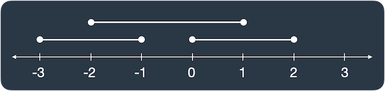

## 문제 설명

- 출처: [프로그래머스 120876 : 겹치는 선분의 길이](https://school.programmers.co.kr/learn/courses/30/lessons/120876)

선분 3개가 평행하게 놓여 있습니다. 세 선분의 시작과 끝 좌표가 [[start, end], [start, end], [start, end]] 형태로 들어있는 2차원 배열 `lines`가 매개변수로 주어질 때, 두 개 이상의 선분이 겹치는 부분의 길이를 return 하도록 solution 함수를 완성해보세요.

`lines`가 [[0, 2], [-3, -1], [-2, 1]]일 때 그림으로 나타내면 다음과 같습니다.



선분이 두 개 이상 겹친 곳은 [-2, -1], [0, 1]로 길이 2만큼 겹쳐있습니다.

---

## 제한사항

- `lines`의 길이 = 3
- `lines`의 원소의 길이 = 2
- 모든 선분은 길이가 1 이상입니다.
- `lines`의 원소는 [a, b] 형태이며, a, b는 각각 선분의 양 끝점 입니다.
  - -100 ≤ a $<$ b ≤ 100

---

## 입출력 예

| lines                     | result |
| :------------------------ | :----- |
| [[0, 1], [2, 5], [3, 9]]  | 2      |
| [[-1, 1], [1, 3], [3, 9]] | 0      |
| [[0, 5], [3, 9], [1, 10]] | 8      |

- 예제 #1  
  두 번째, 세 번째 선분 [2, 5], [3, 9]가 [3, 5] 구간에 겹쳐있으므로 2를 return 합니다.

- 예제 #2  
  겹친 선분이 없으므로 0을 return 합니다.

- 예제 #2
  - 첫 번째와 두 번째 선분이 [3, 5] 구간에서 겹칩니다.
  - 첫 번째와 세 번째 선분 [1, 5] 구간에서 겹칩니다.
  - 두 번째와 세 번째 선분 [3, 9] 구간에서 겹칩니다.
  - 따라서 [1, 9] 구간에 두 개 이상의 선분이 겹쳐있으므로, 8을 return 합니다.

---

## 풀이 과정

배열을 하나 생성해 선분이 놓이는 위치의 값을 1씩 증가시키고, 1을 초과하는 요소의 수를 반환하는 간단한 방법으로 시도했습니다.

```javascript
function solution(lines) {
  //선분이 존재하는 위치를 배열에 담음
  const line = [];
  for (const [start, end] of lines) {
    for (let i = start; i < end; ++i) {
      line[i] = (line[i] ?? 0) + 1;
    }
  }

  //배열의 요소 중 1을 초과하는 요소의 수를 반환
  return line.filter((count) => count > 1).length;
}
```

하지만 위 코드는 start와 end가 음수인 경우 제대로 작동하지 않아 실패했습니다.
음수를 처리하기 위해 배열이 아닌 맵에 담도록 수정했습니다.

```javascript
function solution(lines) {
  //선분이 존재하는 위치를 맵에 담음
  const line = new Map();
  for (let [start, end] of lines) {
    for (let i = start; i < end; ++i) {
      line.set(i, (line.get(i) ?? 0) + 1);
    }
  }

  //맵의 요소 중 1을 초과하는 요소의 수를 반환
  return [...line.values()].filter((count) => count > 1).length;
}
```

---

### 또다른 방법

배열 대신 맵을 사용 방법으로 이미 해결했지만 배열을 사용하지 못했던 이유는 음수 인덱스를 제대로 처리하지 못하기 때문인데,
이 문제의 경우 `line`의 요소의 값이 -100 이상으로 제한 되어있기 때문에 아래와 같이 인덱스에 100을 더하는 방식으로도 해결할 수 있습니다.

```javascript
function solution(lines) {
  //선분이 존재하는 위치를 배열에 담음
  const line = [];
  for (const [start, end] of lines) {
    for (let i = start; i < end; ++i) {
      //음수를 처리하기 위해 인덱스에 100을 더함 (-100 이상이기 때문)
      line[i + 100] = (line[i + 100] ?? 0) + 1;
    }
  }

  //배열의 요소 중 1을 초과하는 요소의 수를 반환
  return line.filter((count) => count > 1).length;
}
```
