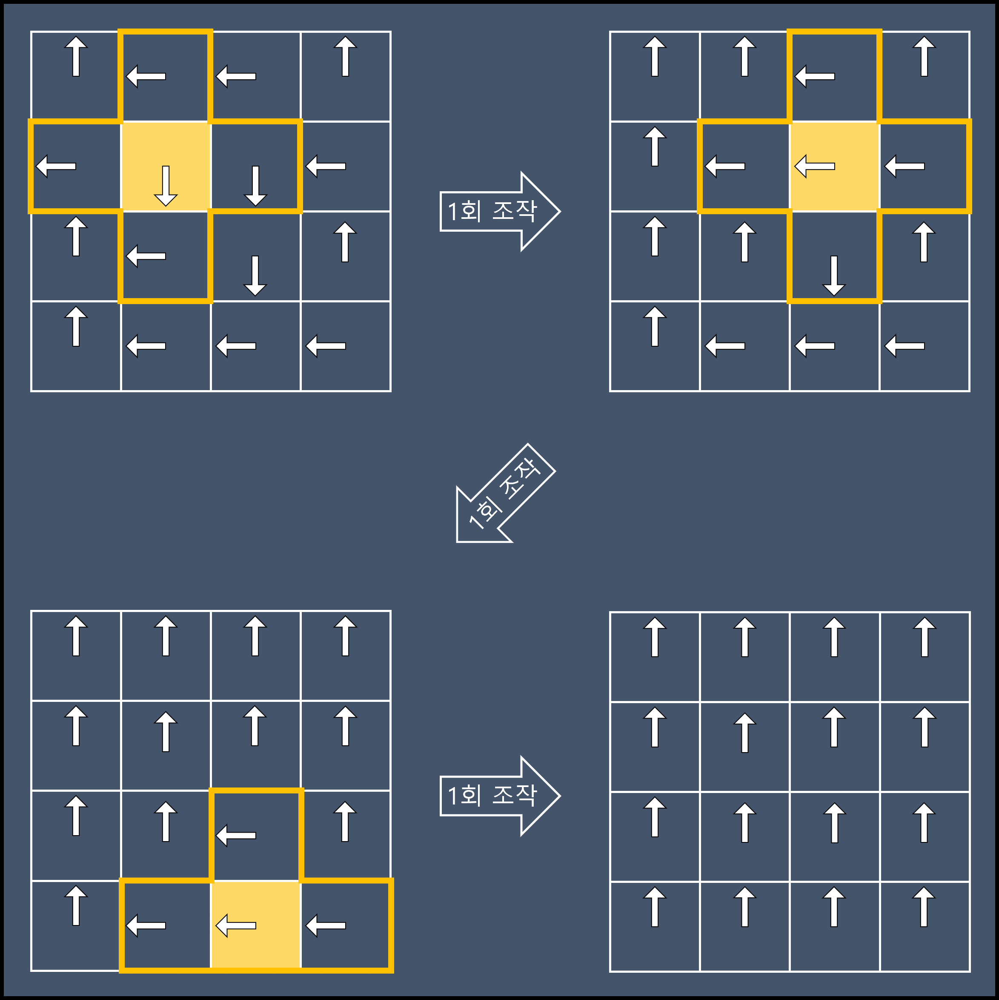

## 문제 설명

- 출처: [프로그래머스 131702 : 고고학 최고의 발견](https://school.programmers.co.kr/learn/courses/30/lessons/131702)

고고학자인 혜선은 오래전부터 성궤의 행방을 추적해왔습니다. 그동안 그의 연구는 주류 학자들로부터 인정받지 못했었지만, 혜선이는 포기하지 않고 조사를 계속했고 마침내 성궤의 행방을 알아내었습니다.

그러나 오래전 누군가로부터 봉인된 성궤는 특별한 잠금장치에 의해 보호되고 있었습니다. 잠금장치는 일종의 퍼즐과 연결되어 퍼즐을 해결하면 열리는 것으로 보입니다.

퍼즐은 시계들이 행렬을 이루는 구조물인데 하나의 시계에 시곗바늘은 하나씩만 있습니다. 각 시곗바늘은 시계방향으로만 돌릴 수 있고 한 번의 조작으로 90도씩 돌릴 수 있습니다. 시계들은 기계장치에 의해 연결되어 있어 어떤 시계의 시곗바늘을 돌리면 그 시계의 상하좌우로 인접한 시계들의 시곗바늘도 함께 돌아갑니다. 행렬의 모서리에 위치한 시계의 시곗바늘을 돌리는 경우에는 인접한 세 시계의 시곗바늘들이 함께 돌아가며, 꼭짓점에 위치한 시계의 시곗바늘을 돌리는 경우에는 인접한 두 시계의 시곗바늘들이 함께 돌아갑니다.

각 시계는 12시, 3시, 6시, 9시 방향 중의 한 방향을 가리키고 있습니다. 각 시계의 시곗바늘을 적절히 조작하여 모든 시곗바늘이 12시 방향을 가리키면 퍼즐이 해결되어 성궤를 봉인하고 있는 잠금장치가 열릴 것입니다.

노후화된 퍼즐 기계장치가 걱정되었던 혜선은 가능한 최소한의 조작으로 퍼즐을 해결하려고 합니다. 시곗바늘들의 행렬 `clockHands`가 매개변수로 주어질 때, 퍼즐을 해결하기 위한 최소한의 조작 횟수를 return 하도록 solution 함수를 완성해주세요.

---

## 제한사항

- 2 ≤ `clockHands`의 길이 ≤ 8
- `clockHands`는 2차원 배열이며 행과 열의 크기가 동일합니다.
- 0 ≤ `clockHands`의 원소 ≤ 3
- `clockHands[i]`의 원소들은 시곗바늘의 방향을 나타내며 0은 12시 방향, 1은 3시 방향, 2는 6시 방향, 3은 9시 방향을 나타냅니다.
- 해결 가능한 퍼즐만 주어집니다.

---

## 입출력 예

| clockHands                                | result |
| :---------------------------------------- | :----- |
| [[0,3,3,0],[3,2,2,3],[0,3,2,0],[0,3,3,3]] | 3      |

- 예제 #1  
  2행 2열의 시곗바늘, 2행 3열의 시곗바늘, 4행 3열의 시곗바늘을 각각 한 번씩 돌리면 최소 조작 횟수로 퍼즐을 해결할 수 있습니다.
  

---

## 풀이 과정 - 시도 1 : 풀(?) 완전 탐색 (실패)

처음에는 단순히 모든 경우의 수를 대입해서 가장 낮은 횟수를 구하는 완전 탐색의 풀이로 해결할 수 있을 것 같았습니다.
그래서 먼저 이 방식으로 풀어보니 $n < 4$일 때 시간 초과가, $n>=4$일 때는 아예 `signal: aborted (core dumped)` 오류가 발생해 실패했습니다.
검색해보니 해당 오류의 경우 메모리 범위를 벗어나거나, 자바스크립트 배열의 최대 크기인 $2^{32}-1$을 초과할 경우 발생한다는 답변이 있었습니다.

:::danger 모든 경우의 수를 만들기 위해 작성된 문제의 함수

```javascript
const createAllCases = (count, arr = [], acc = []) => {
  if (arr.length == count * count) {
    const result = [];
    for (let i = 0; i < count; ++i) {
      result.push(arr.slice(i * count, (i + 1) * count));
    }
    acc.push(result);
    return;
  }
  for (let i = 0; i < 4; ++i) {
    arr.push(i);
    createAllCases(count, arr, acc);
    arr.pop();
  }
  return acc;
};
```

:::

이런 문제가 발생하는 이유가 궁금해 경우의 수를 계산해보니 $n*n$ 행렬에 0~3를 대입하는 경우의 수는 무려 $4^{n*n}$으로, "와 보기만해도 n이 조금만 커져도 난리 나겠네..." 싶었습니다.
직접 계산을 해봐도 입출력 예와 같이 $n=4$의 작은 행렬에서도 $4^{16}$개의 경우의 수가 나오고, 최대 크기인 $n=8$의 경우 $4^{64}$로 무려 39자리의 읽기도 힘든 긴 수가 나왔습니다. 문제의 입력 범위와 풀이의 실행 시간을 미리 생각해보지 않은 제 실수였습니다...

- $n = 2\ \Rightarrow\ 4^{2*2}\ =\ 256$
- $n = 4\ \Rightarrow\ 4^{4*4}\ =\ 4,294,967,296$
- $n = 8\ \Rightarrow\ 4^{8*8}\ =\ 340,282,366,920,938,463,463,374,607,431,768,211,456$ 🤯
  - 심지어 재귀 함수로 구현했고, 함수의 호출이나 로직 등의 모든 부분을 무시하더라도 경우의 수를 만들 때 마다 $n*n$의 행렬을 복사해야한다는 기본 전제가 존재하기 때문에 이보다 더한 연산 횟수가 필요한 셈이죠...

---

## 풀이 과정 - 시도 2 : 첫 줄만 완전 탐색 (성공)

이 문제를 해결하기 위해 많은 시행착오 끝에 문제에서 찾을 수 있는 여러 규칙을 정리하고 경우의 수를 줄여보았습니다.

1. 시곗바늘을 회전시키는 순서가 바뀌어도 각 시곗바늘의 회전 수가 같기 때문에 결과가 동일합니다
2. $(x, y)$의 시곗바늘이 회전하면 $(x, y - 1)$의 시곗바늘도 회전합니다

1번 조건을 이용해 경우의 수 탐색을 한 열씩 차례대로 진행하기로 정했습니다
이렇게 한 열씩 차례대로 진행할 경우 $y$열의 탐색이 끝나면 $y$열의 시곗바늘을 수정할 수 있는 것은 $y+1$열의 같은 행의 시곗바늘 뿐입니다
따라서 $y+1$열에서 $y$열의 행을 0으로 만들지 못하는 행의 값은 생략해도 됩니다.

최종 문제 풀이 방식은 아래와 같습니다.

1. 첫째 열에 들어갈 수 있는 모든 경우의 수를 구한다 : $O(4^n)$
2. 복사한 행렬을 대상으로 나머지 열에 들어갈 수 있는 모든 경우의 수를 구한다 : $O(n^2)$

위 방식대로 진행할 경우 탐색할 경우의 수는 $4^n * n^2$입니다.

- $n = 2\ \Rightarrow\ 4^{2} *\ 2^2\ =\ 64$
- $n = 4\ \Rightarrow\ 4^{4} *\ 4^2\ =\ 4,096$
- $n = 8\ \Rightarrow\ 4^{8} *\ 8^2\ =\ 4,194,304$ 😆

:::info 개선된 코드 전문

```javascript
//2차원 배열의 깊은 복사를 수행하는 함수
const deepcopy = (arr) => arr.map((v) => v.slice());

//주어진 clockHands의 [x, y]와 인접한 시곗바늘을 회전 시키는 함수
const rotateHand = (x, y, clockHands, rotate) => {
  //십자 형태로 탐색하기 위한 x, y 방향 값
  const dx = [0, -1, 1, 0, 0];
  const dy = [0, 0, 0, -1, 1];

  for (let i = 0; i < 5; i++) {
    const nx = x + dx[i];
    const ny = y + dy[i];
    if (clockHands[ny] !== undefined && clockHands[ny][nx] !== undefined) {
      clockHands[ny][nx] = (clockHands[ny][nx] + rotate) % 4;
    }
  }
};

//첫째 열에 대한 모든 경우의 수를 생성하는 함수 (4 ** n 개)
//빠른 생성을 위해 캐시 배열을 사용합니다
//spead 연산자를 이용해 항상 새 배열을 만들기 때문에 deepcopy를 사용할 필요는 없습니다.
const caseCache = [, [[0], [1], [2], [3]]];
const createFirstRowCases = (count) => {
  const results = [];

  for (let i = 0; i < 4; ++i) {
    const permutations = caseCache[count - 1] ?? createFirstRowCases(count - 1);
    const attached = permutations.map((permutation) => [i, ...permutation]);
    results.push(...attached);
  }

  return (caseCache[count] = results);
};

//나머지 열은 바로 위 열을 기준으로 회전 시키고 성공 시 시도 횟수를 반환하는 함수
const tryOtherRows = (clockHands, count) => {
  const length = clockHands.length;
  for (let y = 1; y < length; ++y) {
    for (let x = 0; x < length; ++x) {
      const rotate = 4 - clockHands[y - 1][x];
      if (rotate === 4) {
        continue;
      }

      rotateHand(x, y, clockHands, rotate);
      count += rotate;
    }
  }
  if (clockHands[length - 1].every((el) => el === 0)) {
    return count;
  }

  return null;
};

function solution(originClockHands) {
  const length = originClockHands.length;
  let answer = Number.MAX_SAFE_INTEGER;

  createFirstRowCases(length).forEach((firstRow) => {
    let count = 0;
    const clockHands = deepcopy(originClockHands);
    firstRow.forEach((rotate, x) => {
      rotateHand(x, 0, clockHands, rotate);
      count += rotate;
    });

    count = tryOtherRows(clockHands, count);
    if (count !== null) {
      answer = Math.min(answer, count);
    }
  });

  return answer;
}
```

:::
