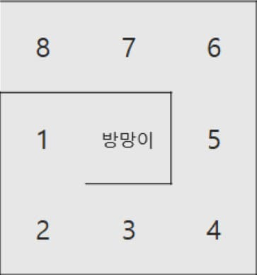
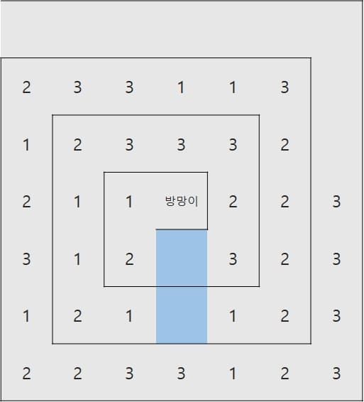
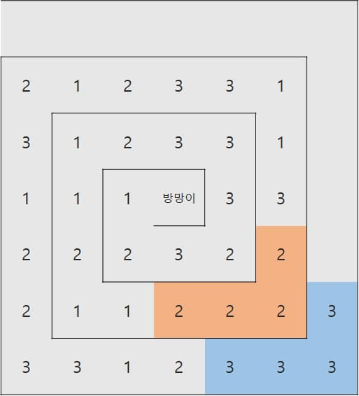
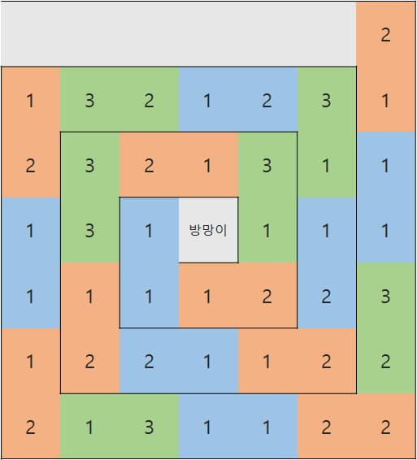

## 문제

유니는 부자가 되고싶어 설레는 마음으로 카지노에갔다. 어떤 게임에 소중한돈을 걸어볼 지 고민하다가, 구슬치기를 하기로 정하였다. 이 카지노의 구슬치기의 룰은 조금 특별하다 게임판은 크기가 NxN인 격자이며 N은 항상 홀수이고 (i, j)는 격자의 i행, j열을 의미한다. 격자의 가장 왼쪽 윗 칸은 (1, 1)이고, 가장 오른쪽 아랫 칸은 (N, N)이며 ((N+1)/2, (N+1)/2)에는 방망이가 있다. 다음은 N = 3, 5인 경우의 예시이다. 실선은 벽이고 칸에 적혀있는 수는 칸의 번호이다.

  


게임을 시작하려면 방향 dK와 거리 sK를 정해야 한다. 위, 아래, 왼쪽, 오른쪽 네가지 방향으로 방망이를 내리칠 수 있고, 정수 방향은 차례대로 1, 2, 3, 4로 나타낸다. 방망이는 dK방향으로 거리가 sK 이하인 모든 칸을 내리쳐 구슬을 파괴한다. 구슬이 파괴되면 그 칸은 구슬이 들어있지 않은 빈 칸이된다. 방망이는 벽을 파괴하지 않는다.

다음 예시는 아래방향으로 거리 2만큼 방망이를 내리쳤을 때의 예시이다.

  


게임판은 방망이를 중심으로 경사가 져있어서 빈 칸이 생기면 옆에 구슬이 굴러가서 빈칸으로 이동한다. 이 이동은 더이상 구슬이 이동하지 않을때까지 반복되며, 모든 구슬이 이동한 결과는 다음과 같다.


방망이를 내리치고 구슬의 이동이 끝났다면, 4개 이상 연속하는 구슬이 있을경우 연속된 구슬들은 모두 폭발한다. 다음예시에서 왼쪽그림은 연속하는 구슬을 표시한 것이고, 오른쪽 그림은 구슬이 모두 폭발했을 때를 표시하였다.

  


구슬이 폭발한 후 다시 빈칸이 생겼으니 구슬이 경사로 인해 구르기 시작한다. 구슬이 이동한 후에 다시 연속된 구슬이 존재할경우 폭발하며 과정은 더이상 폭발할 수 있는 구슬이 없을때까지 반복된다. 위의 예시에서는 더이상 구슬이 폭발할 수 없으므로 최종상태는 다음과 같다.


더이상 폭발할 구슬이 없어지면 구슬은 분열을 시작한다. 연속하는 구슬은 서로 연결되며 다음그림은 연결된 구슬들을 표시한 것이다.


연결된 구슬들은 합쳐진 후 구슬A, B로 분열한다. 구슬 A는 연결된 구슬의 개수이며 B는 연결된 구슬의 번호이다.  
구슬은 1번칸부터 차례대로 A, B의 순서로 들어간다. 다음 그림은 구슬이 분열한 후이다. 색은 구분하기 위해 위의 그림에 있는 연결된 구슬의 색을 그대로 사용했다.  
만약, 구슬이 칸의 수보다 많아 칸에 들어가지 못하는 구슬이 있으면 그 구슬들은 버린다.



게임을 총 M번 진행하였을때 점수는 1×(폭발한 1번 구슬의 개수) + 2×(폭발한 2번 구슬의 개수) + 3×(폭발한 3번 구슬의 개수)가 된다. 위의 예시에서는 2번구슬이 4개, 3번구슬이 4개 폭발하였으므로 2×4 + 3×4, 즉 20점을 획득하였다.

## 입력

첫째 줄에 N, M이 주어진다. 둘째 줄부터 N개의 줄에는 격자에 들어있는 구슬의 정보가 주어진다. i번째 행의 j번째 정수는 (i, j)에 들어있는 구슬의 번호를 의미한다. 어떤 칸에 구슬이 없으면 0이 주어진다. 방망이가 있는 칸도 항상 0이 주어진다.  
다음 M개의 줄에는 방망이를 내리치는 방향 dK와 거리 sK가 한 줄에 하나씩 마법을 시전한 순서대로 주어진다. ( 3 ≤ N ≤ 49, 1 ≤ M ≤ 100, 1 ≤ dK ≤ 4, 1 ≤ sK ≤ (N-1)/2 )

## 출력

첫째 줄에 1×(폭발한 1번 구슬의 개수) + 2×(폭발한 2번 구슬의 개수) + 3×(폭발한 3번 구슬의 개수)를 출력한다.

```예제_입력_1
7 1
0 0 0 0 0 0 0
2 3 3 1 1 3 0
1 2 3 3 3 2 0
2 1 1 0 2 2 3
3 1 2 2 3 2 3
1 2 1 3 1 2 3
2 2 3 3 1 2 3
2 2
```

```예제_출력_1
20
```

```예제_입력_2
7 4
1 1 2 2 2 2 3
2 2 1 1 2 2 3
2 3 3 1 3 1 2
1 2 1 0 3 1 2
3 1 2 2 2 2 2
3 3 2 2 3 1 2
2 1 2 2 2 1 2
2 2
2 3
3 1
2 3
```

```예제_출력_2
23
```

```예제_입력_3
7 7
1 2 1 2 2 2 3
2 2 2 1 2 2 3
2 2 3 2 3 1 2
1 2 1 0 3 2 1
3 1 2 1 3 3 1
2 1 2 1 2 2 1
2 1 2 1 1 1 1
1 2
2 2
3 3
4 3
2 2
2 3
1 3
```

```예제_출력_3
31
```

---

## 풀이

작성 중

```C++
#include <iostream>
#define X 0
#define Y 1
#define MAX 50
using namespace std;

const int LEFT = 0, DOWN = 1, RIGHT = 2, UP = 3, OVER = 4;
const int DK_MAP[5] = {-1, UP, DOWN, LEFT, RIGHT}; //dK => 방향 매핑
const int MOVES[4][2] = { //방향 => {x, y} 매핑
  {-1, 0}, //왼쪽
  {0 ,1},  //아래
  {1 ,0},  //오른쪽
  {0, -1}, //위쪽
};

//입력 받은 격자 배열을 1차원 배열로 펼치는 함수
void grid2linear(int n, int (&grid)[MAX][MAX], int arr[]){
  const int center = (n + 1) / 2 - 1; //격자의 중앙 = 방망이의 위치

  int k = 0,
      x = center,
      y = center,
      direction = LEFT, //방향
      walls = 1, //지나가야할 벽의 수
      step = 0; //걸음 수

  for(int i = 0; i < n * n; ++i){
    arr[k++] = grid[x][y];

    x += MOVES[direction][X];
    y += MOVES[direction][Y];

    //걸음 수가 지나가야할 벽의 수와 같다면
    if(++step == walls){
      step = 0; //걸음 수를 초기화하고
      direction = (direction + 1) % 4; //방향을 변경한다

      //만약 변경된 방향이 왼쪽이나 오른쪽이면
      if(direction == RIGHT || direction == LEFT){
        ++walls; //지나가야할 벽의 수를 증가시킨다
      }
    }
  }
}

//구슬을 앞으로 당겨 정렬하는 함수
void sortBeads(int n, int arr[]){
  int k = 1;
  for(int i = 1; i < n * n; ++i){
    if(arr[i] != 0){
      arr[k++] = arr[i];
    }
  }
  for(int i = k; i < n * n; ++i){
    arr[k++] = arr[0];
  }
}

//구슬을 폭발 시키고 얻은 점수를 반환하는 함수
int boomBeads(int n, int arr[]){
  int point = 0, //얻은 점수
      beed = 0, //현재 구슬
      count = 0; //연속된 구슬의 수

  for(int i = 1; i < n * n; ++i){
    if(arr[i] == beed){ //현재 구슬이 연속해서 나온 경우
      ++count; //연속된 구슬의 수를 증가시킨다
    }else{//새 숫자의 구슬이 나온 경우
      if(count >= 4){ //현재 구슬의 개수가 4개 이상이면
        for(int j = i - count; j < i; ++j){
          arr[j] = 0; //연결된 모든 구슬을 폭발 시키고
        }
        point += beed * count; //폭발한 구슬의 점수를 더한다
      }

      //현재 구슬을 업데이트 한다
      beed = arr[i];
      count = 1;
    }
  }

  return point;
}

//방망이 내리치고, 얻은 점수를 반환하는 함수
int hitBat(int n, int arr[]){
  int dK, sK;
  //방망이를 내리치는 방향(dK)와 거리(sK) 입력 받기
  cin >> dK >> sK;

  int direction = DK_MAP[dK];
  int totalPoint = 0;
  while(true){
    int point = boomBeads(n, arr);
    if(point == 0){
      break;
    }
    //1 10 27
    //3 14 33
    //5 18 39
    //7 22 45

    sortBeads(n, arr);
    totalPoint += point;
  }

  return totalPoint;
}

int main() {
  int n, m;
  //격자의 가로세로 길이(N)와
  //방망이를 내리치는 횟수(M) 입력 받기
  cin >> n >> m;

  //격자 정보 입력 받기
  int grid[MAX][MAX];
  for(int x = 0; x < n; ++x){
    for(int y = 0; y < n; ++y){
      cin >> grid[y][x];
    }
  }

  //격자 배열을 1차원 배열로 변환하기
  int linear[n * n];
  grid2linear(n, grid, linear);
  sortBeads(n, linear);

  //방망이 내리치기를 m회 실행하고 점수를 합한다
  int point = 0;
  for(int i = 0; i < m; ++i){
    point += hitBat(n, linear);
  }

/*
  for(int i = 0; i < n * n; ++i){
    cout << linear[i] << " ";
  }
  cout << endl;*/


  cout << point;

  return 0;
}
```
